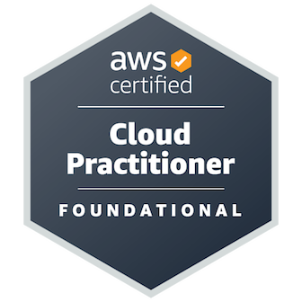

# Welcome to My GitHub Profile!

## About Me

Hey there! I'm Pawan, a passionate MERN stack developer with an intermediate level of expertise. I have a strong background in building web applications using modern technologies and tools. Currently, I'm expanding my skillset by diving into the exciting worlds of data science and AWS.

## My Skills
)

- **Front-end Development**: I have hands-on experience in developing dynamic and responsive user interfaces using React.js. I'm proficient in HTML, Tailwind CSS, and JavaScript ES6, and I'm always eager to stay up-to-date with the latest front-end frameworks and libraries.

- **Back-end Development**: With Node.js and Express.js, I have built robust and scalable server-side applications, RESTful APIs, and integrated databases using MongoDB. I'm also familiar with authentication and authorization.

- **Database Management**: I have worked extensively with MongoDB and firebase. I'm comfortable writing efficient queries and handling database operations.

- **Data Science**: Currently, I'm diving into the fascinating world of data science. I'm learning about data manipulation, exploratory data analysis, and machine learning algorithms. I'm honing my skills in Python and utilizing popular libraries like NumPy, Pandas, and Scikit-learn.

- **AWS**: Alongside my data science journey, I'm also exploring Amazon Web Services (AWS). I'm learning about various AWS services such as EC2, S3, Lambda, and more, to understand how to deploy and manage applications in the cloud.

## My Projects

Here are a few noteworthy projects I've worked on:

Feel free to explore my repositories for more projects and code samples!

## Get in Touch

I'm always open to collaboration and discussing exciting opportunities. If you'd like to get in touch with me, feel free to reach out via [email](mailto:bpawan2002@gmail.com) or connect with me on [LinkedIn](https://www.linkedin.com/in/pawankumar-b-482728184/).

Looking forward to connecting with fellow developers and exploring new avenues together!
